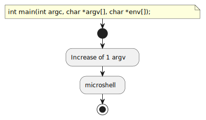
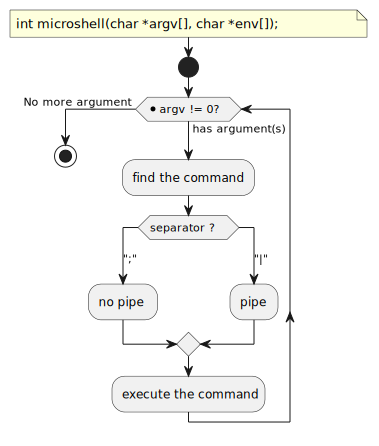
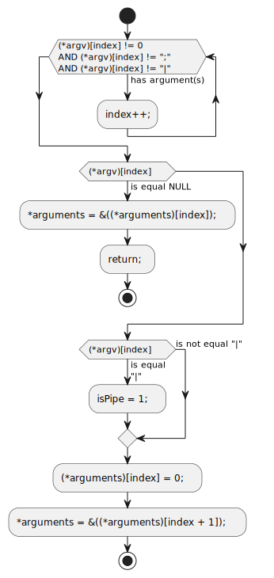
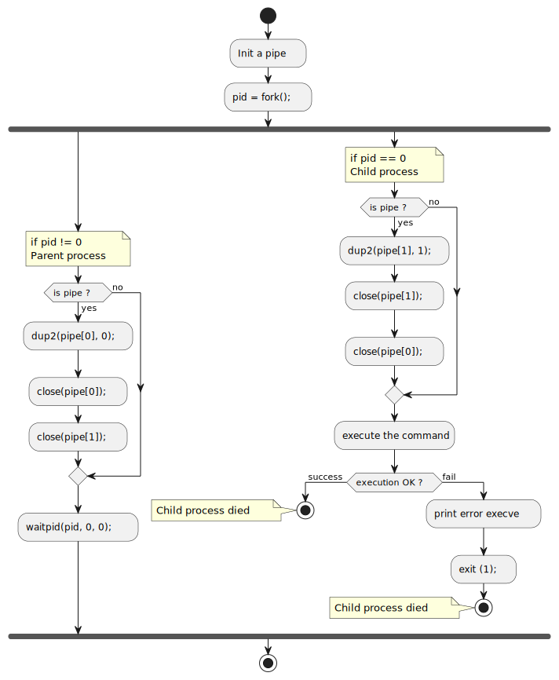

= Examen 04
:nofooter:

____
Microshell
____

== Usage

* You have to use the absolute path
* You can only use `;` (command separtor) or `|` (pipe)

[source,bash]
----
./micro /bin/ls ";" /bin/ls -la
----

== main

[source, c]
----
int	main(int argc, char **argv, char **envp)
{
	if (argc == 1)
		return 0;

	++argv;

	return microshell(argv, envp);
}
----

== microshell

[source, c]
----
static int	microshell(char **arguments, char **envp)
{
	t_command	cmd;

	while (*arguments)
	{
		cmd.isPipe = 0;
		cmd.bin = *arguments;
		cmd.args = arguments;
		find_command(&arguments, &cmd);
		init_pipe(&cmd);
		if (cd_command(&cmd))
			execute_command(&cmd, envp);
	}

	return 0;
}
----

== find the command

== pipe

