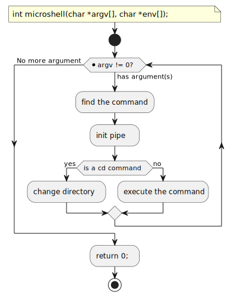

= Examen 04
:nofooter:

____
Microshell
____

== Usage

* You have to use the absolute path
* You can only use `;` (command separtor) or `|` (pipe)

[source,bash]
----
./micro /bin/ls ";" /bin/ls -la
----

== main

[souce, c]
----
int	main(int argc, char **argv, char **envp)
{
	if (argc == 1)
		return 0;

	++argv;

	return microshell(argv, envp);
}
----

== microshell

== find the command

== pipe

image::assets/pipe.svg[schema]
