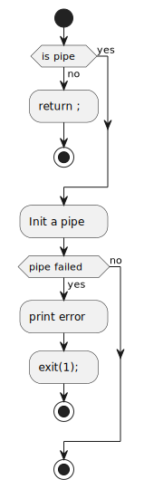

= Examen 04
:nofooter:
:toc: left
:sectnums:
:source-highlighter: highlight.js
:stylesheet: assets/my-stylesheet.css

____
Microshell
____

== Usage

* You have to use the absolute path
* You can only use `;` (command separtor) or `|` (pipe)

[source,bash]
----
./micro /bin/ls ";" /bin/ls -la
----

== main

image::assets/main.svg[schema]

[source, c]
----
int	main(int argc, char **argv, char **envp)
{
	if (argc == 1)
		return 0;

	++argv;

	return microshell(argv, envp);
}
----

== microshell

image::assets/microshell.svg[schema]

[source, c]
----
static int	microshell(char **arguments, char **envp)
{
	t_command	cmd;

	while (*arguments)
	{
		cmd.isPipe = 0;
		cmd.bin = *arguments;
		cmd.args = arguments;
		find_command(&arguments, &cmd);
		init_pipe(&cmd);
		if (cd_command(&cmd))
			execute_command(&cmd, envp);
	}

	return 0;
}
----

== find the command

image::assets/find-the-command.svg[schema]

[source, c]
----
static void	find_command(char ***arguments, t_command *cmd)
{
	int	index;

	index = 0;
	while ((*arguments)[index]
		&& strcmp((*arguments)[index], ";")
		&& strcmp((*arguments)[index], "|"))
		++index;
	if ((*arguments)[index] == 0)
	{
		*arguments = &((*arguments)[index]);
		return ;
	}
	if (!strcmp((*arguments)[index], "|"))
		cmd->isPipe = 1;
	(*arguments)[index] = 0;
	*arguments = &((*arguments)[index + 1]);
}
----

== Init pipe

[source, c]
----
static void	init_pipe(t_command *cmd)
{
	if (!(cmd->isPipe))
		return ;
	if (pipe(cmd->fd) == -1)
	{
		print_error("microshell: error: pipe\n");
		exit(1);
	}
}
----

== Execution

[source,c]
----
static void	execute_command(t_command *cmd, char **envp)
{
	int	pid;

	pid = fork();

	if (pid == 0)
	{
		if (cmd->isPipe)
		{
			dup2(cmd->fd[1], 1);
			close(cmd->fd[1]);
			close(cmd->fd[0]);
		}
		if (execve(cmd->bin, cmd->args, envp) == -1)
		{
			print_error("microshell: Error execve\n");
			exit(1);
		}
	}
	else
	{
		if (cmd->isPipe)
		{
			dup2(cmd->fd[0], 0);
			close(cmd->fd[0]);
			close(cmd->fd[1]);
		}
		waitpid(pid, 0, 0);
	}
}
----
